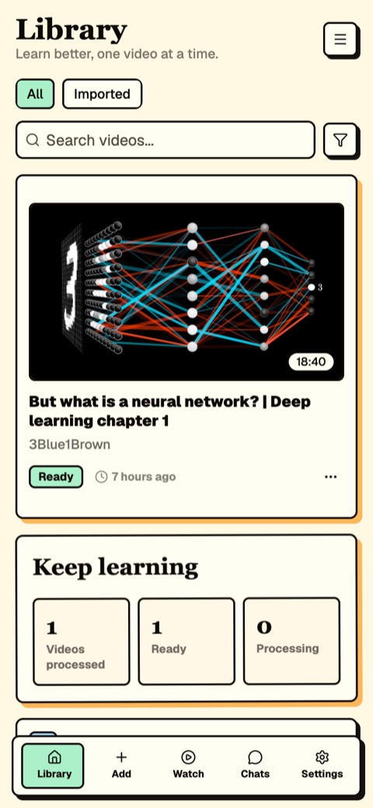
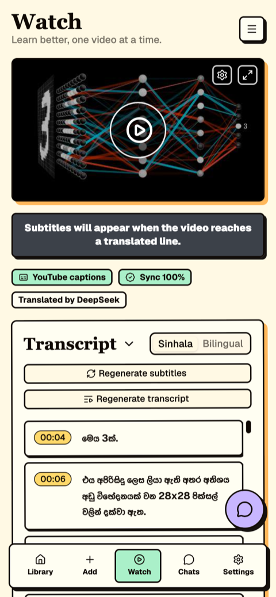
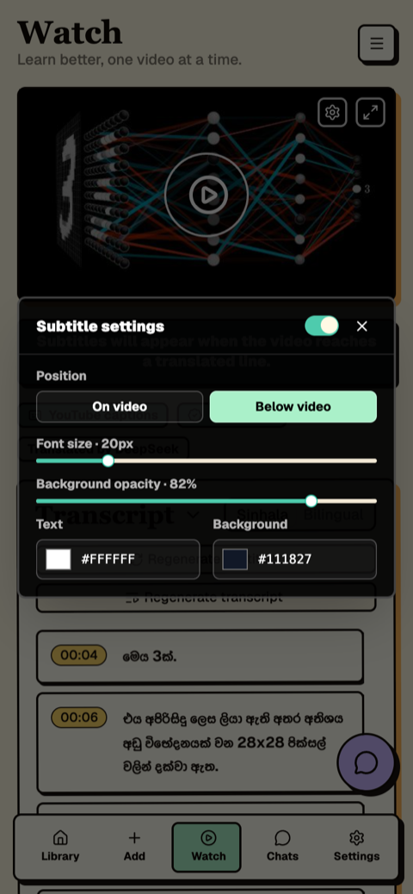
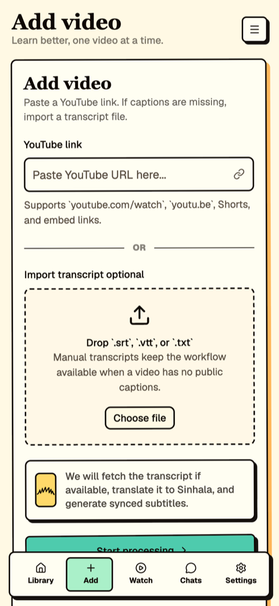
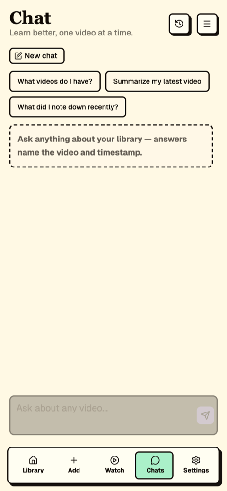
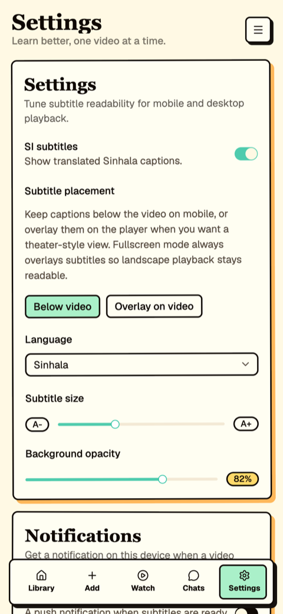
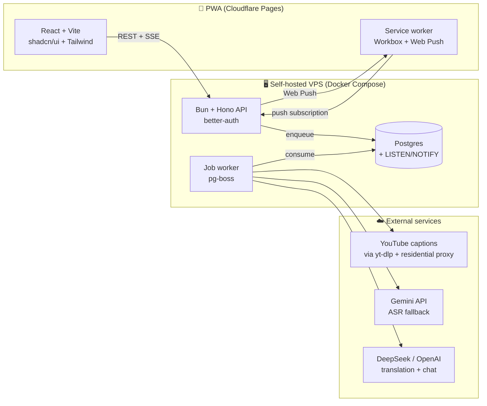
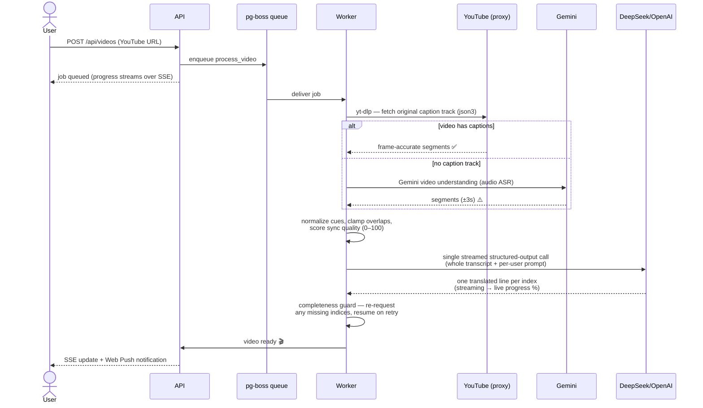

<div align="center">

# 🎬 Vidura

**Learn from any English YouTube video — with perfectly synced Sinhala subtitles.**

A mobile-first, installable PWA that fetches a video's transcript, translates it
with an LLM, and overlays synchronized Sinhala subtitles on the embedded player —
plus an AI chat assistant grounded in everything you've watched.

</div>

---

## Why Vidura exists

The best educational content on YouTube — math, programming, science, engineering —
is overwhelmingly in English. For Sinhala speakers that language barrier turns a
20-minute lesson into a struggle. YouTube's own auto-translated captions are
word-salad for Sinhala; paid dubbing services don't cover it at all.

Vidura's intention is simple: **make English educational video genuinely watchable
for Sinhala speakers**, with translations that read like something a person would
actually say — not word-for-word calques — and timestamps accurate to the frame.
Everything is self-hosted: your library, your notes, your chat history live on
your own server.

## Screenshots

| Library | Watch + synced subtitles | Subtitle controls |
| :---: | :---: | :---: |
|  |  |  |

| Add a video | AI chat | Settings |
| :---: | :---: | :---: |
|  |  |  |

## Features

- 🎯 **Frame-accurate subtitles** — timestamps come from YouTube's own caption
  track (fetched via yt-dlp through a residential proxy), not from audio guessing.
- 🗣️ **Natural translation** — the whole transcript is translated in a single
  structured-output LLM call (DeepSeek or OpenAI) with full video context, so
  terminology stays consistent and sentences flow across subtitle lines.
- 🏷️ **Provenance & quality badges** — every video shows where its timestamps
  came from (*YouTube captions* vs *AI transcribed*), a computed **Sync %** score
  (overlaps, ordering, runtime coverage), and which model translated it.
- 🎛️ **VLC-style subtitle controls** — font size, text/background colour,
  opacity, vertical position, on-video overlay or below-player placement; all
  respected in fullscreen (portrait and landscape).
- 💬 **Transcript-grounded chat** — ask questions about one video or your whole
  library; answers cite the video and timestamp. Streaming, session history,
  configurable tone/language.
- 📝 **Timestamped notes** pinned to the exact moment in the video.
- 🔔 **Web push notifications** when a video finishes processing.
- 📱 **Installable PWA** — Add to Home Screen on iOS/Android, offline shell,
  live processing progress streamed over SSE.
- 🌍 **Any target language** — Sinhala is the default, but the translation
  language and system prompt are per-user settings.

## How it works

### System architecture



### Video processing pipeline



### Subtitle rendering

The YouTube IFrame player runs with all native controls hidden. The app polls
`getCurrentTime()` every 250 ms and binds it against each segment's
`startMs → endMs` window, rendering the active line as a styled overlay (or
below the player). Because the timestamps are YouTube's own caption timings,
the subtitle you read is the sentence being spoken.

## Tech stack

| Layer | Choices |
| --- | --- |
| Frontend | React 19, Vite, TypeScript, Tailwind CSS, shadcn/ui, TanStack Query, Zustand, vite-plugin-pwa |
| Backend | Bun, Hono, better-auth (Google OAuth + optional email/password), postgres.js |
| Jobs & realtime | pg-boss durable queue, SSE via Postgres LISTEN/NOTIFY |
| Transcripts | yt-dlp (+ residential proxy) → Gemini fallback |
| Translation & chat | DeepSeek (via OpenRouter) or OpenAI structured outputs, streamed |
| Notifications | Web Push (VAPID) layered onto the Workbox service worker |
| Deploy | Frontend on Cloudflare Pages · API/worker/Postgres via Docker Compose behind nginx |

## Self-hosting

### Prerequisites

- [Bun](https://bun.sh) ≥ 1.1
- Docker (for Postgres locally, everything in production)
- API keys: OpenRouter **or** OpenAI (translation + chat); optional Gemini key
  (transcript fallback) and a residential proxy URL (frame-accurate captions)

### Local development

```bash
git clone https://github.com/theetaz/vidura.git
cd vidura

# 1. Backend
cd server
cp .env.example .env         # fill in your keys
bun install
bun run dev:db               # local Postgres via Docker (port 55432)
bun run db:apply             # apply schema
bun run dev                  # API on :8787
bun run worker:dev           # job worker (second terminal)

# 2. Frontend (repo root, third terminal)
bun install
bun run dev                  # Vite on :5173
```

### Production

The `server/` directory ships a `docker-compose.yml` (API + worker + Postgres)
designed to sit behind nginx with TLS. The frontend is a static Vite build —
deploy `dist/` to any static host (Cloudflare Pages works out of the box).

All configuration is environment variables — see
[`server/.env.example`](server/.env.example) (documented inline) and
[`server/.env.production.example`](server/.env.production.example).

| Variable | Purpose |
| --- | --- |
| `DATABASE_URL`, `PORT`, `API_BASE_URL`, `WEB_ORIGIN` | Core wiring |
| `BETTER_AUTH_SECRET`, `GOOGLE_CLIENT_ID/SECRET`, `AUTH_EMAIL_PASSWORD` | Auth |
| `YOUTUBE_PROXY_URL` | Residential proxy → yt-dlp fetches YouTube's own captions |
| `GEMINI_API_KEY`, `GEMINI_MODEL`, `YOUTUBE_API_KEY` | Transcript fallback + metadata |
| `TRANSLATION_PROVIDER`, `OPENROUTER_*`, `OPENAI_*` | Translation & chat models |
| `VAPID_PUBLIC_KEY`, `VAPID_PRIVATE_KEY`, `VAPID_SUBJECT` | Web push |

### Why the residential proxy?

YouTube hard-blocks datacenter IPs, so a VPS cannot fetch captions directly.
A pay-as-you-go residential proxy (~1 MB per video, pennies per month) lets
yt-dlp download the video's **own caption track** — the difference between
frame-accurate subtitles and ±3-second ASR guesses. Without a proxy, Vidura
automatically falls back to Gemini transcription and labels the video
accordingly in the UI.

## Project structure

```
├── src/                    # React PWA
│   ├── app/                # screens, player, subtitle engine
│   ├── features/           # auth, videos, notifications (API clients)
│   └── stores/             # Zustand (subtitle prefs, persisted)
├── public/sw-push.js       # push / notification-click handlers
├── server/
│   ├── src/routes/         # Hono routes (videos, chat, notes, push, settings)
│   ├── src/jobs/           # pg-boss worker — the processing pipeline
│   ├── src/lib/            # youtube.ts, openai.ts, subtitle-quality.ts, push.ts
│   └── db/schema.sql       # Postgres schema
└── .github/screenshots/       # README assets
```
